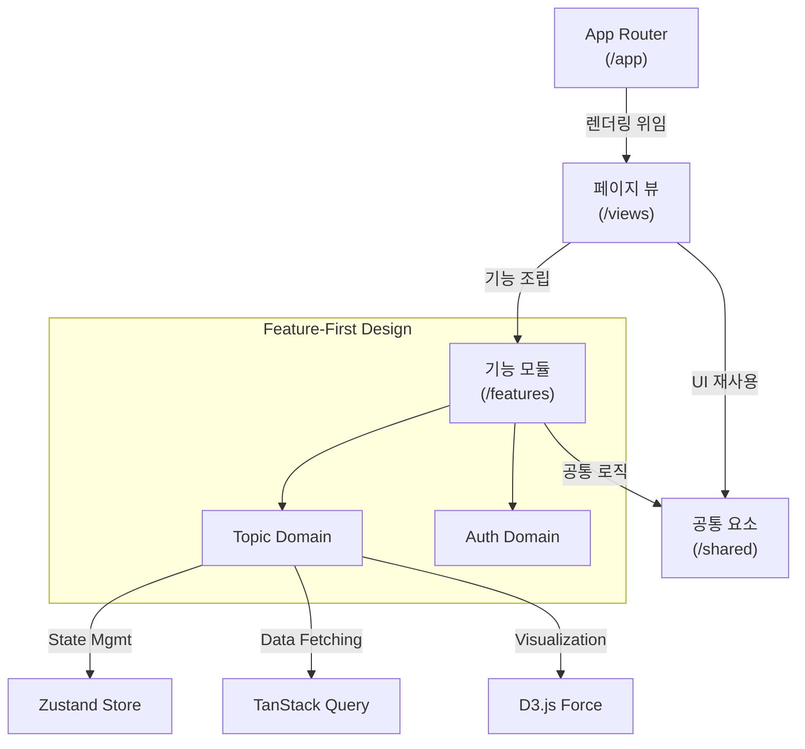
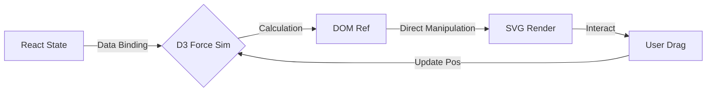
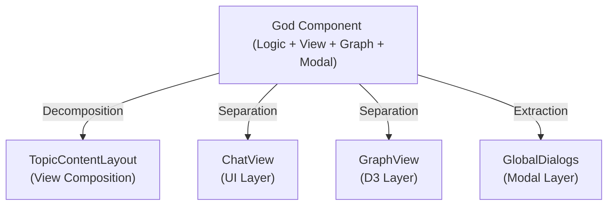
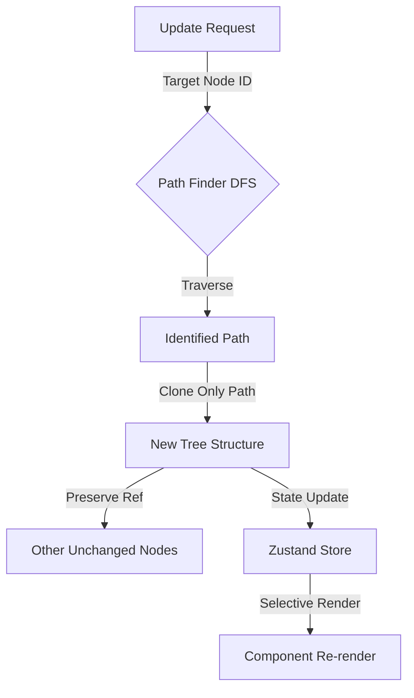
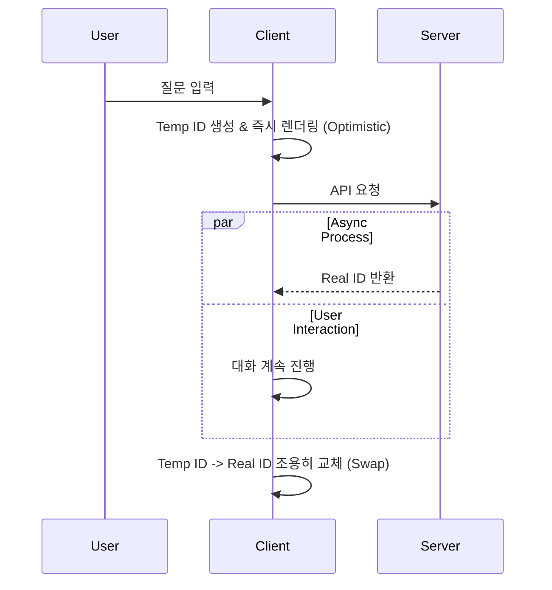

# [chatGraph] - AI 대화 시각화 플랫폼

## 1. 전체적인 아키텍처

- **Architecture**: Next.js App Router 기반의 **Feature-First Architecture**를 도입하여 UI와 비즈니스 로직(Feature)의 관심사를 명확히 분리하고 유지보수성을 극대화했습니다.

## Case 1. 비선형적 대화 구조를 위한 물리 엔진 기반 시각화 구현
### 1. 문제 원인
- 일반적인 선형 채팅 UI(List)는 꼬리에 꼬리를 무는 사고의 확장 과정을 직관적으로 표현하지 못하는 한계가 있었습니다.
- 1차원적인 나열 방식은 대화의 깊이(Depth)와 맥락적 연결 관계(Relation)를 파악하기 어렵게 만들었습니다.

### 2. 해결 과정

- 관계 중심의 시각화를 위해 **D3.js Force Simulation**을 도입하여 노드 간의 유기적인 역학 관계를 구현했습니다.
- **Hybrid Rendering 전략**을 사용하여, React는 데이터의 생명주기(Mount/Unmount)만 관리하고 실제 위치 계산과 DOM 조작은 D3에 위임하여 두 라이브러리 간의 충돌을 방지했습니다.
- 노드의 진입/퇴장을 부드럽게 처리하기 위해 `requestAnimationFrame` 루프 내에서 물리 연산을 최적화했습니다.

### 3. 결과
- **성과**: 복잡한 대화 흐름을 한눈에 파악할 수 있는 인터랙티브 그래프를 구현하여 **60fps**의 부드러운 사용자 경험을 달성했습니다.
- **배운 점**: Declarative(React) 환경에서 Imperative(D3) 로직을 안전하게 통합하는 **Lifecycle Hooking** 기법을 체득했습니다.

## Case 2. Feature-First 아키텍처 도입을 통한 관심사 분리 및 복잡도 해결
### 1. 문제 원인
- `Topic` 관련 컴포넌트가 하나의 파일(`index.tsx`)에 **340줄** 이상 집중된 'God Component'가 되어 유지보수가 불가능했습니다.
- 기능(Features)과 페이지(Views)의 경계가 모호하여 모듈 간 **순환 참조(Circular Dependency)** 문제가 빈번히 발생했습니다.

### 2. 해결 과정

- **Feature-First Architecture**를 적용하여 `app`(라우팅), `features`(도메인), `views`(조립), `shared`(공통)로 디렉토리 구조를 엄격히 재설계했습니다.
- 거대한 컴포넌트를 **View Composition 패턴**을 사용하여 `TopicContentLayout`(뼈대), `ChatView`(채팅), `GraphView`(그래프)로 분리하고 책임을 분산시켰습니다.
- 상위 레벨의 Layout이 하위 View를 조합하는 방식으로 데이터 흐름을 단방향으로 정비하여 순환 참조를 원천 차단했습니다.

### 3. 결과
- **성과**: 핵심 컴포넌트의 라인 수를 340줄에서 **45줄**로 87% 감소시키고, 코드의 응집도(Cohesion)를 높이고 결합도(Coupling)를 낮췄습니다.
- **배운 점**: 좋은 아키텍처는 단순히 폴더를 나누는 것이 아니라, 각 모듈의 **책임과 역할(Role & Responsibility)**을 정의하는 것임을 배웠습니다.

## Case 3. 무한 재귀 트리(Recursive Tree)의 렌더링 성능 최적화
### 1. 문제 원인
- 대화가 길어져 트리의 깊이(Depth)가 10단계 이상 깊어질 경우, 하위 노드 하나를 수정했는데 전체 트리가 리렌더링되는 성능 저하가 발생했습니다.
- 중첩된 객체 구조에서 특정 노드를 찾기 위한 탐색 비용이 기하급수적으로 증가했습니다.

### 2. 해결 과정

- 전체 트리를 순회하지 않고 변경 대상 노드까지의 경로(Path)를 즉시 찾아내는 **DFS 기반 Path Finder** 알고리즘을 구현했습니다.
- 상태 불변성(Immutability)을 유지하면서도 변경이 필요한 가지(Branch)만 정밀하게 교체하는 **Partial Update Strategy**를 적용했습니다.
- `React.memo`와 커스텀 `arePropsEqual` 비교 로직을 결합하여 불필요한 리렌더링을 차단했습니다.

### 3. 결과
- **성과**: 10 Depth 이상의 깊은 계층 구조에서도 렌더링 지연 없는 즉각적인 상태 반영 속도를 확보했습니다.
- **배운 점**: 자료구조(Tree)에 대한 이해가 프론트엔드 상태 관리(State Management)의 성능을 결정짓는 핵심 요소임을 깨달았습니다.

## Case 4. 실시간 몰입감을 위한 비동기 UX 최적화 (Optimistic & Suspense)
### 1. 문제 원인
- 질문 생성 시 서버 응답(약 0.5초)을 기다리는 동안 화면이 멈춰있는 듯한 경험이 사용자 몰입(Flow)을 저해했습니다.
- 데이터 로딩 시 전체 화면이 깜빡이는 'Loading Flickering' 현상이 발생했습니다.

### 2. 해결 과정

- **Temp ID 기반 낙관적 업데이트(Optimistic Update)**를 도입하여, 서버 응답 대기 없이 즉시 새로운 노드를 트리에 렌더링했습니다.
- **TanStack Query**를 도입하여 서버 데이터 캐싱과 백그라운드 동기화를 자동화하고, **React Suspense** 경계를 적절히 배치하여 로딩 중에도 Skeleton UI를 통해 부드러운 전환을 제공했습니다.

### 3. 결과
- **성과**: 체감 반응 속도 **0ms**를 달성하여 사용자가 끊김 없이 사고를 확장할 수 있는 몰입 환경을 구축했습니다.
- **배운 점**: UX 최적화는 기술적인 속도 향상뿐만 아니라, 사용자의 **인지적 대기 시간(Cognitive Wait Time)**을 줄이는 심리적 설계가 포함됨을 배웠습니다.

## 4. 배운 점 (Insights)
- **Architecture Matters**: 초기 개발 속도보다 중요한 것은 '변경에 유연한 구조'임을 뼈저리게 느꼈으며, Feature-First 도입으로 이를 증명했습니다.
- **UX Tech**: D3.js, Optimistic Update, Suspense 등 어려운 기술들은 결국 "사용자의 생각 흐름을 방해하지 않는다"는 하나의 목표를 위해 존재함을 깨달았습니다.
- **Engineering Depth**: 단순 구현을 넘어 자료구조(Tree), 알고리즘(DFS), 디자인 패턴(Composition)을 프론트엔드에 녹여내며 엔지니어링 역량을 깊게 다졌습니다.
