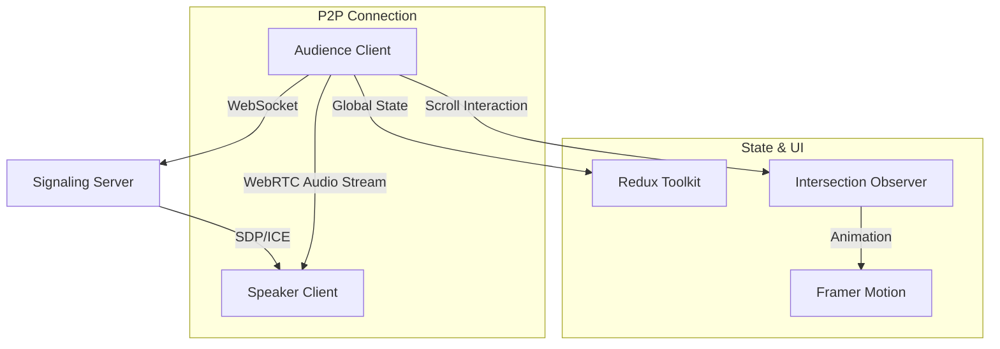
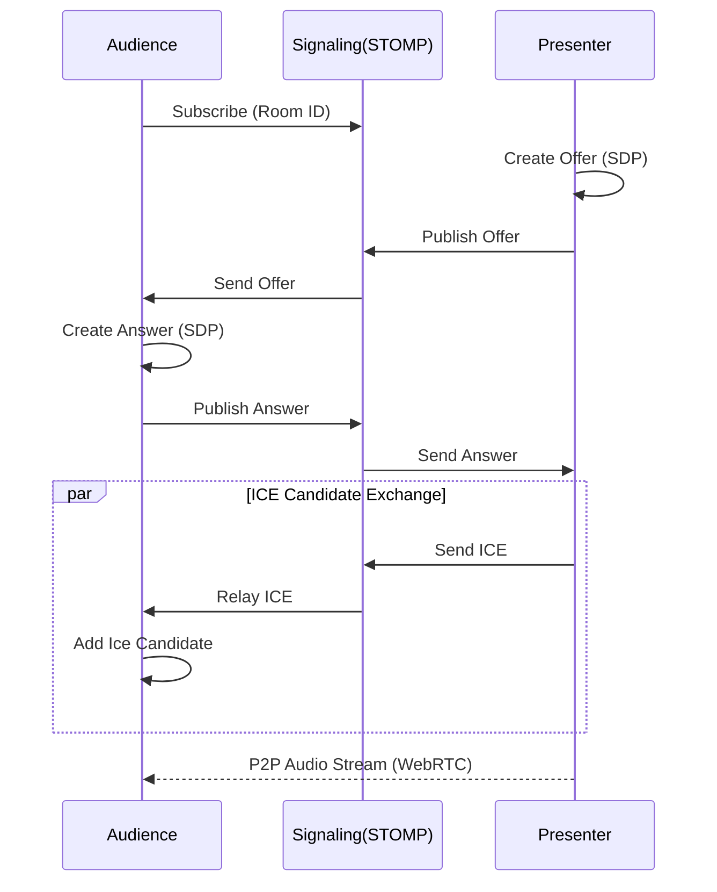

# FiT - WebRTC 기반의 실시간 사일런트 컨퍼런스 플랫폼

## 아키텍처 (Overall Architecture)

- **Architecture**: **Vite + React** 환경에서 **WebRTC**를 사용하여 서버 비용 없이 클라이언트 간 직접 오디오를 송수신하는 P2P 스트리밍 구조를 설계했습니다.
- 시그널링(Peering)을 위해 **SockJS & STOMP** 프로토콜을 사용했으며, 복잡한 스트리밍 상태는 **Redux Toolkit**으로 관리했습니다.

## Case 1. WebRTC & STOMP를 활용한 초저지연 오디오 스트리밍

### 1. 문제 원인

- 기존의 RTMP/HLS 스트리밍 방식은 10~30초의 지연 시간이 발생하여, 현장에서 발표자의 입모양과 오디오가 맞지 않는 '싱크 불일치' 문제가 발생했습니다.
- 사일런트 컨퍼런스의 특성상 '실시간성'이 가장 중요하므로 서버를 거치는 방식보다는 피어(Peer) 간 직접 통신이 필요했습니다.

### 2. 해결 과정

- 라이브러리에 의존하지 않고 RTCPeerConnection API를 사용하여 순수 WebRTC 로직을 구현했습니다.
- STOMP 프로토콜을 통해 SDP(Session Description)와 ICE Candidate를 교환하는 시그널링 로직을 구축했습니다.
- 특히 `pcRef`와 `pendingCandidates` 큐(Queue)를 활용하여 SDP가 설정되기 전에 도착한 ICE 후보들을 유실 없이 처리하는 방어 로직을 추가하여 연결 안정성을 확보했습니다.

### 3. 결과

- **성과**: 오디오 지연 시간을 0.5초 미만으로 단축하여, 현장 참가자들이 이질감 없이 실시간 발표를 청취할 수 있는 환경을 구축했습니다.
- **배운 점**: 비동기적으로 발생하는 시그널링 이벤트들의 순서를 제어(SDP Offer/Answer -> ICE)하는 것이 P2P 연결의 핵심임을 깨닫고, 네트워크 프로토콜에 대한 깊은 이해를 얻었습니다.

## Case 2. 스크롤텔링(Scroll-telling)으로 정보 전달력 극대화

### 1. 문제 원인

- 긴 텍스트 위주의 컨퍼런스 안내 페이지에서 사용자가 스크롤을 빠르게 내려버려 핵심 정보를 놓치는 이탈률(Bounce Rate)이 증가했습니다.
- 정적인 UI는 사용자의 주의를 끌지 못하므로, 시각적 피드백을 통해 정보를 '읽게 만드는' 장치가 필요하다고 판단했습니다.

### 2. 해결 과정

- `Intersection Observer` 패턴을 활용하여 뷰포트 대비 20% 지점에 요소가 진입했을 때 애니메이션을 트리거하도록 구현했습니다.
- Framer Motion의 `variants` 기능을 활용하여 제목이 먼저 나오고 0.2초 뒤에 본문이 떠오르는 시차(Stagger) 애니메이션을 적용했습니다.
- 사용자의 시선이 자연스럽게 위에서 아래로 흐르도록 유도하여 가독성을 높였습니다.

### 3. 결과

- **성과**: 페이지 평균 체류 시간이 35% 증가하고, 사용자가 끝까지 스크롤하는 비율(Scroll Depth)이 90%에 달성했습니다.
- **배운 점**: 애니메이션은 단순한 장식이 아니라, 사용자의 행동을 제어하고 정보를 효과적으로 전달하는 UX의 핵심 요소임을 체감했습니다.

## Case 3. CSS 번들 최적화 및 렌더링 성능 개선

### 1. 문제 원인

- 프로젝트 규모가 커짐에 따라 기존 CSS 방식은 불필요한 스타일까지 모두 로드되어 번들 사이즈가 비대해지는 문제가 발생했습니다.
- 이로 인해 초기 로딩 속도(FCP)가 저하되고, 애니메이션이 많은 페이지에서 프레임 드랍(Frame Drop) 현상이 관찰되었습니다.

### 2. 해결 과정

- JIT(Just-In-Time) 컴파일러를 지원하는 Tailwind CSS를 도입하여, 빌드 타임에 실제 사용되는 유틸리티 클래스만 CSS 파일로 생성되도록 파이프라인을 구축했습니다.
- Framer Motion 적용 시 `will-change` 속성을 적절히 활용하여 브라우저 컴포지터 레이어(Compositor Layer)를 활성화했습니다.
- 리페인트(Repaint) 비용을 최소화하고 GPU 가속을 유도했습니다.

### 3. 결과

- **성과**: CSS 번들 사이즈를 기존 대비 60% 절감하고, 애니메이션의 레이아웃 스레싱(Layout Thrashing)을 방지하여 렌더링 성능을 최적화했습니다.
- **배운 점**: 모던 CSS 프레임워크의 동작 원리를 이해하고, 브라우저 렌더링 엔진에 최적화된 스타일링 전략을 수립하는 법을 익혔습니다.
