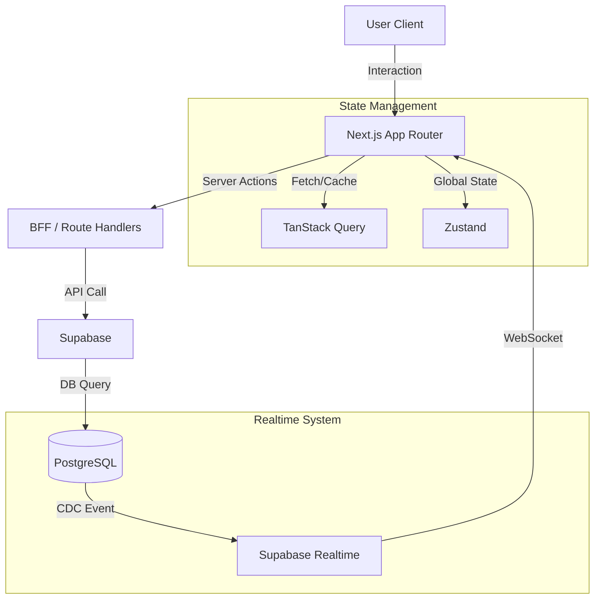
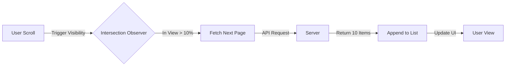
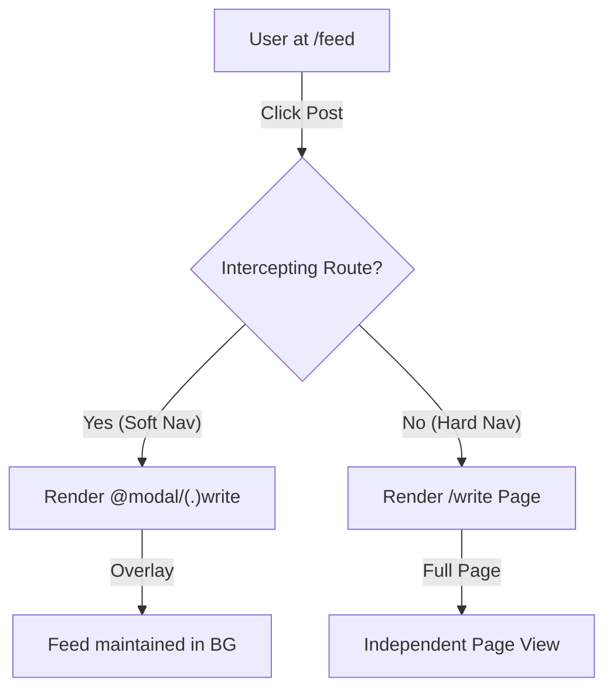
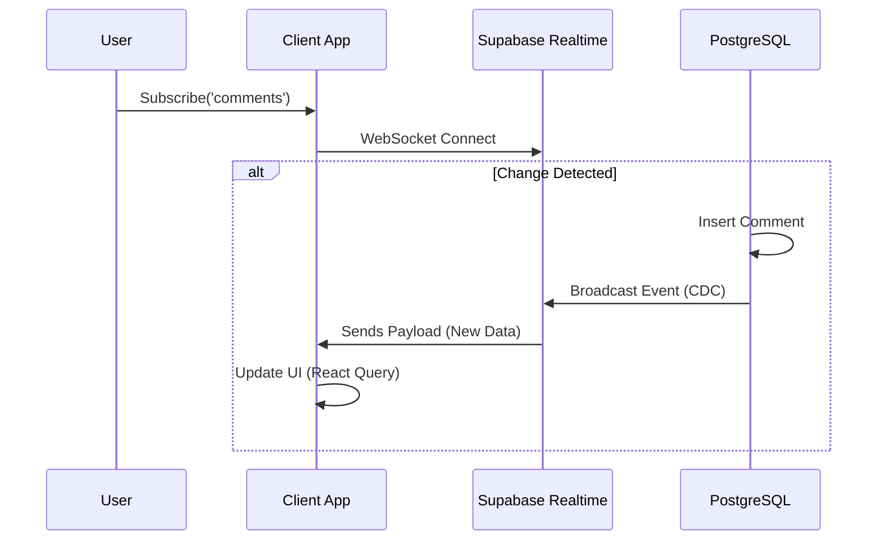

# xAB - 실시간 투표 및 소통 중심의 A/B 테스트 SNS

## 아키텍처 (Overall Architecture)

- **Architecture**: **Next.js App Router** 기반의 프론트엔드와 **Supabase**의 서버리스 백엔드를 결합하여 구축했습니다.
- 특히 **TanStack Query**와 **Zustand**를 활용해 서버 상태와 클라이언트 상태를 철저히 분리 관리함으로써, 실시간성이 중요한 SNS 서비스의 **데이터 무결성(Data Integrity)**을 보장하는 데 초점을 맞췄습니다.

## Case 1. 웹 바이탈(LCP) 최적화를 위한 지연 로딩 전략

### 1. 문제 원인

- 메인 피드 접속 시 수백 개의 투표 게시글 데이터를 한 번에 호출하여 LCP(Largest Contentful Paint)가 2.5초 이상 지연되는 현상이 발생했습니다.
- 이는 초기 로딩 시 뷰포트(Viewport) 밖의 보이지 않는 데이터까지 모두 Fetching 및 Rendering 하여 브라우저의 메인 스레드가 블로킹되고 네트워크 리소스가 낭비되었기 때문입니다.

### 2. 해결 과정

초기 로딩 속도를 개선하기 위해 사용자가 볼 가능성이 높은 상위 10개의 데이터만 우선적으로 로드하고 나머지는 스크롤 시점에 가져오는 Lazy Loading 전략을 수립했습니다. `useInfiniteQuery`로 데이터를 페이지 단위로 분할하고, `Intersection Observer` API를 활용해 뷰포트 하단의 투명 트리거 요소가 10% 이상 노출될 때만 다음 페이지를 호출하도록 구현하여 불필요한 리소스 낭비 없이 끊김 없는 스크롤 경험을 제공했습니다.

### 3. 결과

- **성과**: 초기 로딩 데이터 90% 감소(100개 → 10개)로 LCP 시간을 2.5초에서 1.2초로 약 50% 단축했습니다.
- **배운 점**: 무조건적인 데이터 로딩보다 브라우저 렌더링 원리를 고려한 청크(Chunk) 단위의 데이터 관리가 성능 최적화의 핵심임을 체감했습니다.

---

## Case 2. Soft Navigation을 위한 고급 라우팅 패턴 적용

### 1. 문제 원인

- 피드에서 게시글 작성이나 상세 투표 화면으로 이동할 때마다 전체 페이지가 리로드(Full Page Refresh) 되어, 보던 피드의 위치를 잃어버리고 탐색 흐름이 끊기는 문제가 있었습니다.
- 기존의 라우팅 방식은 페이지 컨텍스트를 완전히 교체해버리기 때문에, 이전 화면(피드)의 상태를 유한 채 상호작용할 수 없는 구조적 한계가 원인이었습니다.

### 2. 해결 과정

- 탐색 흐름을 유지하기 위해 URL 변경 시에도 이전 피드 화면을 배경(Background)으로 남겨두고 그 위에 모달을 띄우는 방식을 고안했습니다.
- Next.js의 Parallel Routes(`@modal`)와 Intercepting Routes(`(.)write`) 기능을 결합하여, 사용자가 피드 내에서 링크를 클릭할 때는 모달로 렌더링하고, 새로고침이나 직접 URL로 접근할 때는 독립 페이지로 렌더링하는 하이브리드 UX를 구현했습니다.

### 3. 결과

- **성과**: 페이지 이동 없이 즉각적인 콘텐츠 전환으로 CLS(Cumulative Layout Shift) 점수를 개선하고 사용자 탐색 이탈률을 줄였습니다.
- **배운 점**: 라우팅이 반드시 '페이지 교체'를 의미하지 않으며, 소프트 내비게이션(Soft Navigation) 패턴이 UX에 미치는 긍정적 영향을 확인했습니다.

## Case 3. 실시간성을 위한 Supabase Realtime(CDC) 도입

### 1. 문제 원인

- SNS 특성상 댓글이나 투표가 빈번하게 발생하는데, 사용자가 직접 '새로고침'을 누르기 전까지는 최신 데이터를 볼 수 없는 정적인 환경이 소통을 저해했습니다.
- 주기적으로 데이터를 요청하는 폴링(Polling) 방식은 불필요한 API 호출과 서버 부하를 야기하는 비효율이 존재했습니다.

### 2. 해결 과정

- 데이터베이스의 변경 사항(Change Data Capture)을 실시간으로 감지하여 클라이언트에 푸시해주는 **Supabase Realtime**을 도입했습니다.
- `postgres_changes` 이벤트를 구독하여 댓글 추가나 투표 발생 시 서버가 즉시 알림을 보내도록 설계했으며, React Query의 캐시 무효화(Invalidation) 로직과 연동하여 사용자의 개입 없이 항상 최신 상태("Live")를 유지하는 피드를 구현했습니다.

### 3. 결과

- **성과**: 새로고침 없는 **실시간 댓글 동기화**를 구현하여 사용자의 체류 시간과 상호작용 빈도를 높였습니다.
- **배운 점**: 폴링(Polling)과 웹소켓(WebSocket) 방식의 장단점을 명확히 이해하고, 서버리스 환경에서 이벤트 기반(Event-driven) 아키텍처를 활용하는 법을 익혔습니다.
